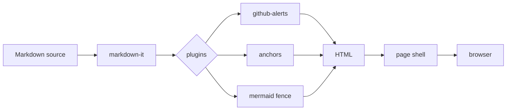

# Architecture

A few words about how `localpages` is wired internally. Use this page to exercise Mermaid, anchor previews, and the wide-table breakout.

## Pipeline

The render pipeline is short — Markdown comes in, HTML goes out, with a few targeted plugins along the way.

## Modules

The 0.1.0 codebase is split into a handful of files under `src/`:

| Module | Lines | Role |
|---|---|---|
| `index.mjs` | ~150 | CLI parsing, entry point |
| `render.mjs` | ~120 | markdown-it config, fence overrides, image figures |
| `page.mjs` | ~110 | HTML/CSS shell, client-script inlining |
| `server.mjs` | ~210 | HTTP routes, SSE, file watch |
| `export.mjs` | ~120 | ZIP bundling, source embedding |
| `zip.mjs` | ~95 | DEFLATE archive writer |
| `security.mjs` | ~60 | Source-root resolution, blocklist |
| `constants.mjs` | ~30 | MIME, language, and source-extension maps |

Total: under 2 000 lines.

## Wide-content breakout

The default content column is 980 px wide. Tables that need more room can opt in with `
`:

| ID | Step | Input | Output | Notes |
|----|------|-------|--------|-------|
| 1 | Read | `*.md` | string | UTF-8 only |
| 2 | Parse | string | tokens | markdown-it core |
| 3 | Plugins | tokens | tokens | alerts, anchors, fence override |
| 4 | Render | tokens | HTML | with image-figure post-processing |
| 5 | Wrap | HTML | full page | inlines theme + scripts |

## Anchor links

Hover over [the modules section above](#modules) — you should see a floating preview card pop up after a short delay. Click to navigate as usual, or hover-out to dismiss.

## Source viewer

Even from this nested page you can open [`sample.py`](sample.py) in the modal — paths resolve relative to the current document.

## Where to read next

Back to [the index](index.md) for the rest of the feature tour.
