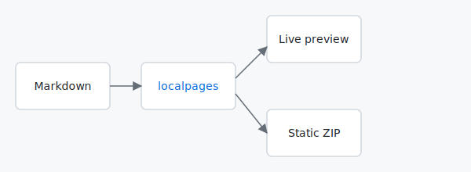

# Welcome to localpages

This is a small example documentation site. Run `npx github:mrtnzlml/localpages` (or `node ../../bin/localpages.mjs` from the repo root) inside this directory to see it rendered.

## What's here

- This page (`index.md`) — a feature tour
- [`architecture.md`](architecture.md) — a Mermaid diagram, JSON5, a wide table, and section anchors
- [`sample.py`](sample.py) — a tiny Python file to demo the source-viewer modal
- `assets/diagram.svg` — a placeholder diagram for the figure rendering

## GitHub-flavored alerts

> [!NOTE]
> This is a `NOTE` callout. Five flavours exist: `NOTE`, `TIP`, `IMPORTANT`, `WARNING`, `CAUTION`.

> [!TIP]
> Hovering a heading reveals a `#` permalink at its left margin. Click to copy a deep link.

> [!WARNING]
> The default blocklist hides `credentials.*`, `.env*`, and other secret-shaped files from the source-file viewer. Add to it with `--block`.

## Code blocks

Plain JavaScript:

```javascript
const greet = (name) => `hello, ${name}`;
console.log(greet('localpages'));
```

A JSON5 fenced block — `//` comments highlight cleanly because the block is treated as JS:

```json5
{
  "name": "localpages",        // the tool
  "version": "0.1.0",          // initial release
  "license": "MIT"
}
```

## Source-file modal

Click on [`sample.py`](sample.py) above. Instead of navigating, a modal opens with the file syntax-highlighted. Press `Esc` or click outside to close.

## Standalone image → figure

The image below is the only thing in its paragraph, so it gets auto-wrapped in `<figure>` and the alt text becomes its caption.



## Inline highlights

Wrap unfinished prose in `<mark>` for a yellow highlight: <mark>this section is TBD</mark>. Useful for marking work-in-progress that should be hard to miss.

## What's next

Head over to [the architecture page](architecture.md) for the Mermaid + JSON5 + wide-table demo.
